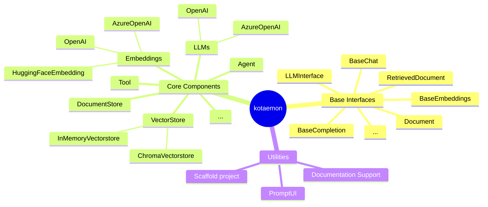

# Contributing

## Setting up

- Clone the repo

  ```shell
  git clone git@github.com:Cinnamon/kotaemon.git
  cd kotaemon
  ```

- Install the environment

  - Create a conda environment (python >= 3.10 is recommended)

    ```shell
    conda create -n kotaemon python=3.10
    conda activate kotaemon

    # install dependencies
    cd libs/kotaemon
    pip install -e ".[all]"
    ```

  - Or run the installer (one of the `scripts/run_*` scripts depends on your OS), then
    you will have all the dependencies installed as a conda environment at
    `install_dir/env`.

    ```shell
    conda activate install_dir/env
    ```

- Pre-commit

  ```shell
  pre-commit install
  ```

- Test

  ```shell
  pytest tests
  ```

## Package overview

`kotaemon` library focuses on the AI building blocks to implement a RAG-based QA application. It consists of base interfaces, core components and a list of utilities:

- Base interfaces: `kotaemon` defines the base interface of a component in a pipeline. A pipeline is also a component. By clearly define this interface, a pipeline of steps can be easily constructed and orchestrated.
- Core components: `kotaemon` implements (or wraps 3rd-party libraries
  like Langchain, llama-index,... when possible) commonly used components in
  kotaemon use cases. Some of these components are: LLM, vector store,
  document store, retriever... For a detailed list and description of these
  components, please refer to the [API Reference](../reference/Summary.md) section.
- List of utilities: `kotaemon` provides utilities and tools that are
  usually needed in client project. For example, it provides a prompt
  engineering UI for AI developers in a project to quickly create a prompt
  engineering tool for DMs and QALs. It also provides a command to quickly spin
  up a project code base. For a full list and description of these utilities,
  please refer to the [Utilities](utilities.md) section.



## Common conventions

- PR title: One-line description (example: Feat: Declare BaseComponent and decide LLM call interface).
- [Encouraged] Provide a quick description in the PR, so that:
  - Reviewers can quickly understand the direction of the PR.
  - It will be included in the commit message when the PR is merged.

## Environment caching on PR

- To speed up CI, environments are cached based on the version specified in `__init__.py`.
- Since dependencies versions in `setup.py` are not pinned, you need to pump the version in order to use a new environment. That environment will then be cached and used by your subsequence commits within the PR, until you pump the version again
- The new environment created during your PR is cached and will be available to others once the PR is merged.
- If you are experimenting with new dependencies and want a fresh environment every time, add `[ignore cache]` in your commit message. The CI will create a fresh environment to run your commit and then discard it.
- If your PR include updated dependencies, the recommended workflow would be:
  - Doing development as usual.
  - When you want to run the CI, push a commit with the message containing `[ignore cache]`.
  - Once the PR is final, pump the version in `__init__.py` and push a final commit not containing `[ignore cache]`.

## Merge PR guideline

- Use squash and merge option
- 1st line message is the PR title.
- The text area is the PR description.
