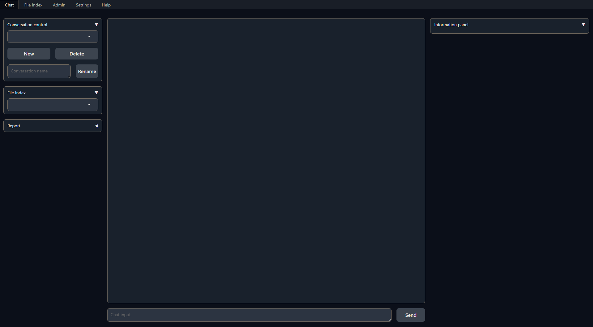

# Getting Started with Kotaemon

This page is intended for end users who want to use the `kotaemon` tool for Question Answering on local documents.

## Download

Download and upzip the latest version of `kotaemon` by clicking this
[link](https://github.com/Cinnamon/kotaemon/archive/refs/heads/main.zip).

## Choose what model to use

The tool uses Large Language Model (LLMs) to perform various tasks in a QA pipeline. So
prior to running, you need to provide the application with access to the LLMs you want
to use.

Please edit the `.env` file with the information needed to connect to the LLMs. You only
need to provide at least one. However, tt is recommended that you include all the LLMs
that you have access to, you will be able to switch between them while using the
application.

Currently, the following providers are supported:

### OpenAI

In the `.env` file, set the `OPENAI_API_KEY` variable with your OpenAI API key in order
to enable access to OpenAI's models. There are other variables that can be modified,
please feel free to edit them to fit your case. Otherwise, the default parameter should
work for most people.

```shell
OPENAI_API_BASE=https://api.openai.com/v1
OPENAI_API_KEY=<your OpenAI API key here>
OPENAI_CHAT_MODEL=gpt-3.5-turbo
OPENAI_EMBEDDINGS_MODEL=text-embedding-ada-002
```

### Azure OpenAI

For OpenAI models via Azure platform, you need to provide your Azure endpoint and API
key. Your might also need to provide your developments' name for the chat model and the
embedding model depending on how you set up Azure development.

```shell
AZURE_OPENAI_ENDPOINT=
AZURE_OPENAI_API_KEY=
OPENAI_API_VERSION=2024-02-15-preview
AZURE_OPENAI_CHAT_DEPLOYMENT=gpt-35-turbo
AZURE_OPENAI_EMBEDDINGS_DEPLOYMENT=text-embedding-ada-002
```

### Local models

- Pros:
  - Privacy. Your documents will be stored and process locally.
  - Choices. There are a wide range of LLMs in terms of size, domain, language to choose
    from.
  - Cost. It's free.
- Cons:
  - Quality. Local models are much smaller and thus have lower generative quality than
    paid APIs.
  - Speed. Local models are deployed using your machine so the processing speed is
    limited by your hardware.

#### Find and download a LLM

You can search and download a LLM to be ran locally from the [Hugging Face
Hub](https://huggingface.co/models). Currently, these model formats are supported:

- GGUF

You should choose a model whose size is less than your device's memory and should leave
about 2 GB. For example, if you have 16 GB of RAM in total, of which 12 GB is available,
then you should choose a model that take up at most 10 GB of RAM. Bigger models tend to
give better generation but also take more processing time.

Here are some recommendations and their size in memory:

- [Qwen1.5-1.8B-Chat-GGUF](https://huggingface.co/Qwen/Qwen1.5-1.8B-Chat-GGUF/resolve/main/qwen1_5-1_8b-chat-q8_0.gguf?download=true):
  around 2 GB

#### Enable local models

To add a local model to the model pool, set the `LOCAL_MODEL` variable in the `.env`
file to the path of the model file.

```shell
LOCAL_MODEL=<full path to your model file>
```

Here is how to get the full path of your model file:

- On Windows 11: right click the file and select `Copy as Path`.

## Installation

1. Navigate to the `scripts` folder and start an installer that matches your OS:
   - Windows: `run_windows.bat`. Just double click the file.
   - macOS: `run_macos.sh`
   - Linux: `run_linux.sh`. If you are using Linux, you would know how to run a bash
     script, right ?
2. After the installation, the installer will ask to launch the ktem's UI,answer to continue.
3. If launched, the application will be available at `http://localhost:7860/`.

## Launch

To launch the app after initial setup or any changes, simply run the `run_*` script again.

A browser window will be opened and greet you with this screen:



## Usage

For how to use the application, see [Usage](/usage). Have fun !

## Feedback

Feel free to create a bug report or a feature request or join a discussion at https://github.com/Cinnamon/kotaemon/issues.
