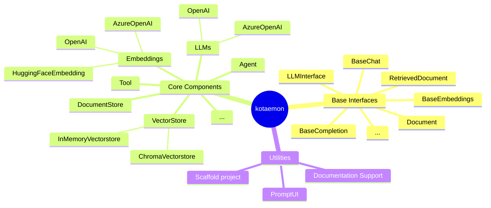

## Introduction

`kotaemon` library focuses on the AI building blocks to implement a RAG-based QA application. It consists of base interfaces, core components and a list of utilities:

- Base interfaces: `kotaemon` defines the base interface of a component in a pipeline. A pipeline is also a component. By clearly define this interface, a pipeline of steps can be easily constructed and orchestrated.
- Core components: `kotaemon` implements (or wraps 3rd-party libraries
  like Langchain, llama-index,... when possible) commonly used components in
  kotaemon use cases. Some of these components are: LLM, vector store,
  document store, retriever... For a detailed list and description of these
  components, please refer to the [API Reference](/reference/nav/) section.
- List of utilities: `kotaemon` provides utilities and tools that are
  usually needed in client project. For example, it provides a prompt
  engineering UI for AI developers in a project to quickly create a prompt
  engineering tool for DMs and QALs. It also provides a command to quickly spin
  up a project code base. For a full list and description of these utilities,
  please refer to the [Tutorial/Utilities](/ultilities) section.



## Expected benefit

Before `kotaemon`:

- Starting everything from scratch.
- Knowledge and expertise is fragmented.
- Nothing to reuse.
- No way to collaborate between tech and non-tech experts.

`kotaemon` expects to completely revolutionize the way we are building LLM-related projects. It helps the company side-steps those issues by:

- Standardize the interface to (1) make building LLM pipeline clearer (2) more reasonable to integrate pipelines between different projects.
- Centralize LLM-related technical components into 1 place. Avoid fragmented technology development. Easy to find the LLM-related technology inside the company.
- Centralize bug fixes and improvements in 1 place.
- Reduce boilerplate code during project development.
- Lightning fast prototyping.

## Install

The kotaemon can be installed from source with:

```
pip install kotaemon@git+ssh://git@github.com/Cinnamon/kotaemon.git
```

or from Cinnamon's internal python package index:

```
pip install kotaemon --extra-index-url https://ian_devpi.promptui.dm.cinnamon.is/root/packages
```

## Example use cases

- Start a project from scratch: `ktem start-project`
- Run prompt engineering UI tool: `ktem promptui export`, then `ktem promptui run`.
