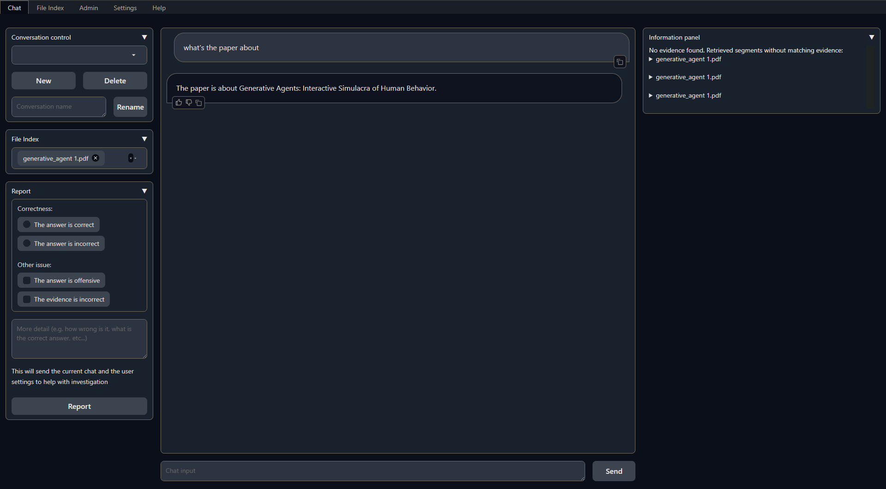
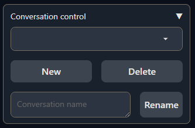
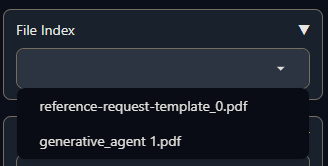
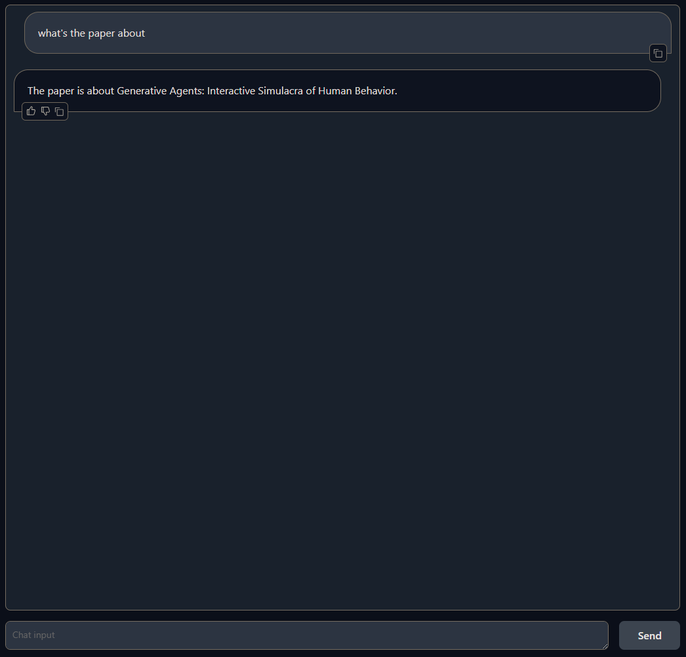
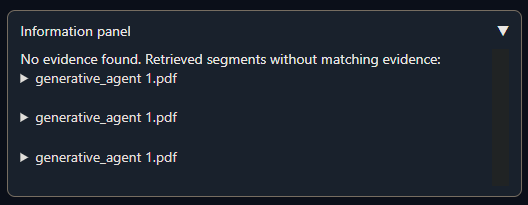
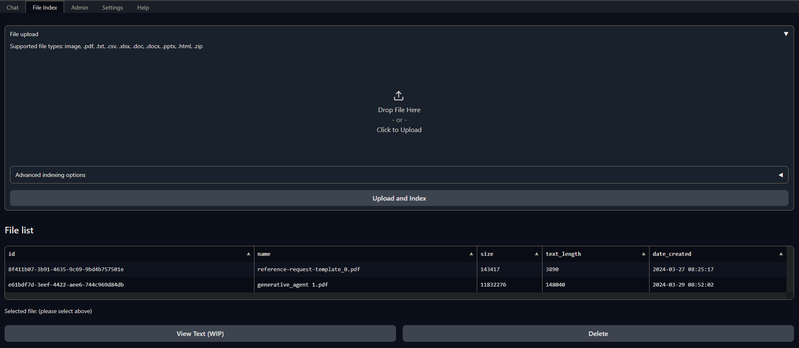
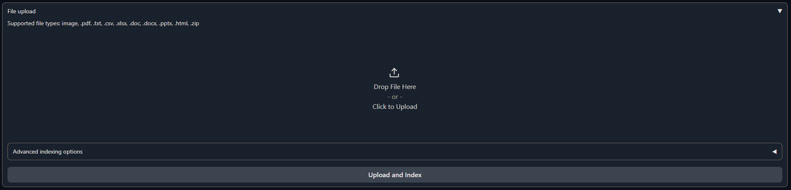

# Basic Usage

## Chat tab

The chat tab is divided into 3 columns:

- Left: Conversation settings
- Middle: Chat interface
- Right: Information panel

### Conversation settings

#### Conversation control

Create, rename, and delete conversations.

#### File index

Choose which files to retrieve references from. If no file is selected, all files will be used.

### Chat interface

Interact with the chatbot.

### Information panel

Supporting information such as the retrieved evidence and reference will be displayed
here.

## File index tab

### File upload

In order for a file to be used as an index for retrieval, it must be processed by the
application first. Do this uploading your file to the UI and then select `Upload and Index`.

The application will take some time to process the file and show a message once it is
done. Then you will be able to select it in the [File index section](#file-index) of the [Chat tab](#chat-tab).

### File list

This section shows the list of files that have been uploaded to the application and
allows users to delete them.

